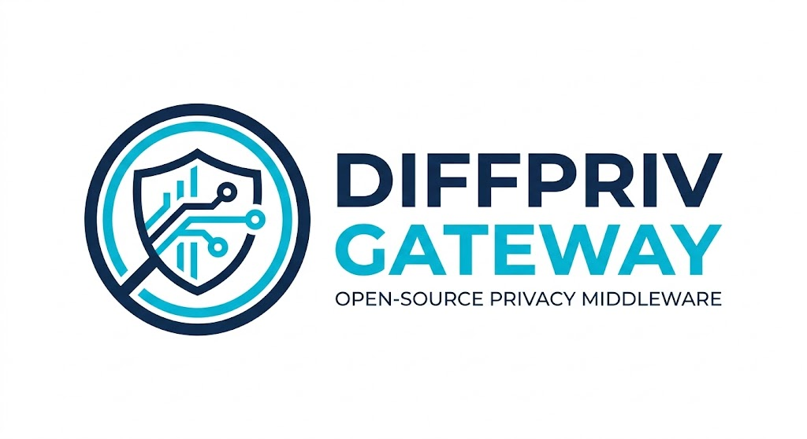

<p align="center">
  
</p>

# DiffPriv-Gateway 🛡️

[](https://www.gnu.org/licenses/gpl-3.0)
[](https://www.python.org/)
[](https://github.com/Dionysis33/DiffPriv-Gateway/graphs/commit-activity)
[](https://github.com/Dionysis33/DiffPriv-Gateway/actions/workflows/python-app.yml)

Το **DiffPriv-Gateway** είναι μια λύση ανοικτού κώδικα (Open-Source) που βοηθά τις Μικρομεσαίες Επιχειρήσεις να συμμορφωθούν με τον **GDPR**, εφαρμόζοντας **Διαφορική Ιδιωτικότητα** (Differential Privacy).


---

## 📋 Πίνακας Περιεχομένων
- [Το Επιχειρηματικό Πρόβλημα](#το-επιχειρηματικό-πρόβλημα)
- [Η Λύση μας](#η-λύση-μας)
- [Βασικά Χαρακτηριστικά](#βασικά-χαρακτηριστικά)
- [Τεχνολογίες & Εργαλεία](#τεχνολογίες--εργαλεία)
- [Οδηγίες Εγκατάστασης](#οδηγίες-εγκατάστασης)
- [Συνεισφορά](#οδηγός-συνεισφοράς)
- [Άδεια Χρήσης](#άδεια-χρήσης)

---

## Το Επιχειρηματικό Πρόβλημα
Οι ΜΜΕ συχνά δεν έχουν τους πόρους για σύνθετες τεχνολογίες προστασίας. Η απλή αφαίρεση ονομάτων (anonymization) δεν αρκεί, καθώς οι ταυτότητες μπορούν να αποκαλυφθούν μέσω συνδυασμού δεδομένων (linkage attacks).

## Η Λύση μας
Αυτό το εργαλείο λειτουργεί ως μια "έξυπνη πύλη" που επεξεργάζεται στατιστικά ερωτήματα. Χρησιμοποιεί τον **Gaussian μηχανισμό** για την προσθήκη ελεγχόμενου θορύβου, διασφαλίζοντας ότι το αποτέλεσμα δεν αποκαλύπτει πληροφορίες για μεμονωμένα άτομα.


## Βασικά Χαρακτηριστικά
* **Low-Code Implementation**: Εύκολη ενσωμάτωση σε υπάρχουσες βάσεις δεδομένων.
* **Gaussian & Laplacian Mechanisms**: Υποστήριξη των κορυφαίων αλγορίθμων ιδιωτικότητας.
* **GDPR Ready**: Σχεδιασμένο με βάση την αρχή "Privacy by Design".

## Τεχνολογίες & Εργαλεία
* **Γλώσσα**: Python 3.12
* **Βιβλιοθήκες**: `diffprivlib` (IBM), `pandas`, `numpy`
* **Version Control**: Git & GitHub Desktop
* **IDE**: VS Code

## Οδηγίες Εγκατάστασης
1. Κλωνοποίηση του αποθετηρίου:
   ```bash
   git clone [https://github.com/Dionysis33/DiffPriv-Gateway.git](https://github.com/Dionysis33/DiffPriv-Gateway.git)
