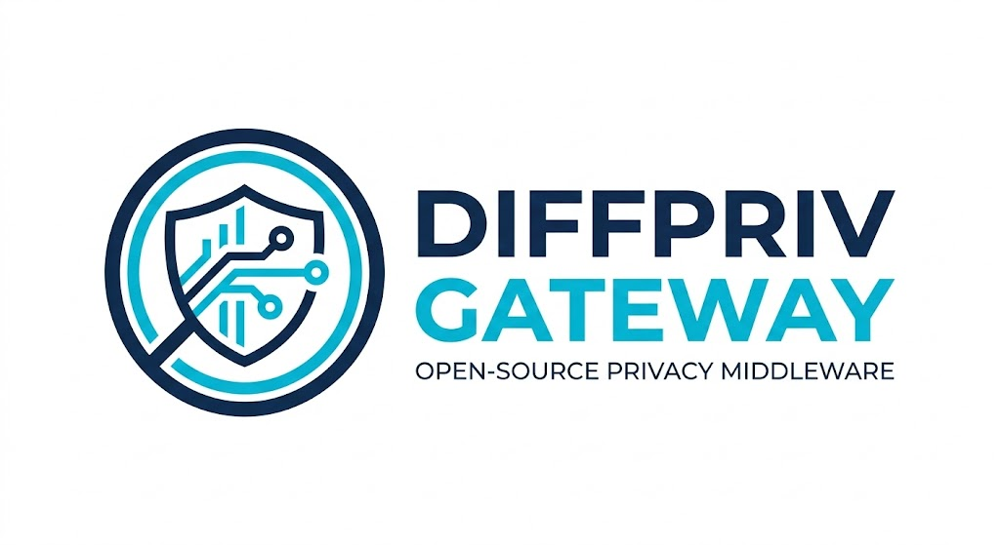

<p align="center">
  
</p>

# DiffPriv-Gateway 

[](https://www.gnu.org/licenses/gpl-3.0)
[](https://www.python.org/)
[](https://github.com/Dionysis33/DiffPriv-Gateway/graphs/commit-activity)
[](https://github.com/Dionysis33/DiffPriv-Gateway/actions/workflows/python-app.yml)

Το **DiffPriv-Gateway** είναι μια λύση ανοικτού κώδικα (Open-Source) που βοηθά τις **Μικρομεσαίες Επιχειρήσεις (SMEs)** να αξιοποιούν data analytics με πιο ασφαλή τρόπο, εφαρμόζοντας **Differential Privacy** και υποστηρίζοντας αρχές του **GDPR**, όπως το **Privacy by Design**, το **Data Minimization** και το **Accountability**.

Το project λειτουργεί ως privacy-preserving middleware ανάμεσα σε datasets και analytical workflows, ώστε τα statistical outputs να παραμένουν χρήσιμα για business analysis χωρίς να εκτίθενται άμεσα raw προσωπικά δεδομένα.

---

##  Πίνακας Περιεχομένων

- [Το Επιχειρηματικό Πρόβλημα](#το-επιχειρηματικό-πρόβλημα)
- [Γιατί η Προστασία Δεδομένων είναι Κρίσιμη για τις SMEs](#γιατί-η-προστασία-δεδομένων-είναι-κρίσιμη-για-τις-smes)
- [Η Λύση μας](#η-λύση-μας)
- [Πώς λειτουργεί σε υψηλό επίπεδο](#πώς-λειτουργεί-σε-υψηλό-επίπεδο)
- [Βασικά Χαρακτηριστικά](#βασικά-χαρακτηριστικά)
- [Τεχνολογίες & Εργαλεία](#τεχνολογίες--εργαλεία)
- [Οδηγίες Εγκατάστασης](#οδηγίες-εγκατάστασης)
- [Γρήγορη Εκτέλεση](#γρήγορη-εκτέλεση)
- [Testing & Quality Assurance](#testing--quality-assurance)
- [Wiki & Documentation](#wiki--documentation)
- [Δομή Repository](#δομή-repository)
- [Συνεισφορά](#συνεισφορά)
- [Άδεια Χρήσης](#άδεια-χρήσης)

---

## Το Επιχειρηματικό Πρόβλημα

Οι SMEs βασίζονται όλο και περισσότερο στα δεδομένα για να βελτιώσουν λειτουργίες, να αναλύσουν συμπεριφορές πελατών, να παράγουν reports και να υποστηρίξουν decision-making. Ωστόσο, τα datasets τους συχνά περιλαμβάνουν προσωπικά ή ευαίσθητα δεδομένα, όπως:

- πληροφορίες εργαζομένων,
- οικονομικά δεδομένα,
- στοιχεία πελατών,
- δανειακά ή μισθολογικά records.

Η απλή αφαίρεση ονομάτων ή η βασική anonymization συχνά **δεν αρκεί**, καθώς μπορεί να υπάρξει **re-identification** μέσω συνδυασμού γνωρισμάτων ή linkage attacks.

Αυτό δημιουργεί αυξημένο κίνδυνο για:

- privacy breaches,
- disclosure of sensitive information,
- regulatory non-compliance ως προς τον GDPR,
- operational και reputational risk για τον οργανισμό.

---

## Γιατί η Προστασία Δεδομένων είναι Κρίσιμη για τις SMEs

Σε αντίθεση με μεγαλύτερους οργανισμούς, οι SMEs συνήθως δεν διαθέτουν:

- εξειδικευμένες privacy engineering ομάδες,
- σύνθετη compliance infrastructure,
- μεγάλους πόρους για advanced data governance solutions.

Παρόλα αυτά, χρειάζονται και αυτές data-driven processes. Το αποτέλεσμα είναι ένα πρακτικό δίλημμα:

**πώς μπορεί μια SME να κάνει χρήσιμα analytics χωρίς να εκθέτει άμεσα προσωπικά δεδομένα;**

Το DiffPriv-Gateway απαντά σε αυτό το πρόβλημα ενσωματώνοντας μηχανισμούς **Differential Privacy** στη ροή ανάλυσης. Αντί να επιστρέφει raw values, το σύστημα παράγει **protected statistical outputs** με ελεγχόμενο θόρυβο, μειώνοντας το disclosure risk και ενισχύοντας την ευθυγράμμιση με τις αρχές του GDPR.

---

## Η Λύση μας

Το DiffPriv-Gateway λειτουργεί ως μια "έξυπνη πύλη" (smart privacy gateway) που επεξεργάζεται numerical/statistical queries πάνω σε datasets και εφαρμόζει μηχανισμούς ιδιωτικότητας πριν από την επιστροφή αποτελεσμάτων.

Η υλοποίηση του project υποστηρίζει **Laplace** και **Gaussian** privacy mechanisms, ανάλογα με το analytical context και το επιθυμητό privacy-utility trade-off.

Κεντρική ιδέα του συστήματος είναι ότι:

- τα raw data δεν πρέπει να εκτίθενται απευθείας,
- τα outputs πρέπει να είναι privacy-aware,
- η προστασία πρέπει να είναι built-in στο pipeline και όχι εξωτερικό add-on,
- το privacy loss πρέπει να ελέγχεται με measurable τρόπο μέσω του **privacy budget**.

---

## Πώς λειτουργεί σε υψηλό επίπεδο

Το DiffPriv-Gateway ακολουθεί μια modular λογική ροή:

1. **Dataset loading**  
   Το σύστημα φορτώνει structured tabular data από CSV αρχεία.

2. **Column selection / query target**  
   Επιλέγεται η αριθμητική στήλη ή το metric που θα προστατευθεί.

3. **Differential Privacy mechanism application**  
   Εφαρμόζεται Laplace ή Gaussian mechanism με βάση:
   - το `epsilon`,
   - το `sensitivity`,
   - και, όπου απαιτείται, bounds / clipping constraints.

4. **Post-processing safeguards**  
   Εφαρμόζονται τεχνικές όπως:
   - clipping,
   - rounding,
   - preservation of output structure.

5. **Protected output generation**  
   Το αποτέλεσμα επιστρέφεται με τρόπο που διατηρεί utility για analytics αλλά μειώνει τον κίνδυνο αποκάλυψης πληροφορίας για μεμονωμένα άτομα.

---

## Βασικά Χαρακτηριστικά

- **Privacy-Preserving Middleware**  
  Το project τοποθετείται ανάμεσα σε raw datasets και analytics workflows.

- **Laplace & Gaussian Mechanisms**  
  Υποστηρίζονται δύο βασικοί μηχανισμοί Differential Privacy για διαφορετικά statistical use cases.

- **Modular Privacy Engine**  
  Η privacy λογική είναι απομονωμένη σε reusable Python module.

- **Clipping & Output Control**  
  Οι protected τιμές μπορούν να περιορίζονται σε αποδεκτά bounds.

- **Testing & Validation Support**  
  Το project συνοδεύεται από automated unit tests και lint validation.

- **GDPR-Oriented Design**  
  Η αρχιτεκτονική ευθυγραμμίζεται με αρχές όπως Privacy by Design, Accountability και Data Minimization.

- **Low-Code / Readable Implementation**  
  Σχεδιασμένο ώστε να είναι κατανοητό, επεκτάσιμο και κατάλληλο για academic/demo/business prototype use.

---

## Τεχνολογίες & Εργαλεία

- **Γλώσσα**: Python 3.12

- **Βιβλιοθήκες**:
  - `diffprivlib`
  - `pandas`
  - `numpy`
  - `pytest`

- **Lint / Validation**:
  - `flake8`

- **Version Control**:
  - Git
  - GitHub

- **IDE**:
  - VS Code

---

## Οδηγίες Εγκατάστασης

### 1. Κλωνοποίηση του αποθετηρίου

```bash
git clone https://github.com/Dionysis33/DiffPriv-Gateway.git
cd DiffPriv-Gateway
```

### 2. Δημιουργία virtual environment

**Windows (PowerShell):**

```powershell
python -m venv .venv
.\.venv\Scripts\Activate.ps1
```

**Linux / macOS:**

```bash
python3 -m venv .venv
source .venv/bin/activate
```

### 3. Εγκατάσταση βασικών dependencies

```bash
pip install -r requirements.txt
```

### 4. Προαιρετικά: εγκατάσταση development dependencies

```bash
pip install -r requirements-dev.txt
```

---

## Γρήγορη Εκτέλεση

Για ένα απλό demo run του project:

```bash
python main.py
```

Αν θέλεις να δεις τη modular υλοποίηση του privacy engine, εξερεύνησε:

- `src/privacy_engine.py`
- `main.py`

Αν θέλεις να δεις testing examples και verification logic:

- `tests/test_privacy_engine.py`
- `tests/test_basic.py`

Αν θέλεις να δεις notebooks / exploratory work:

- `notebooks/`

---

## Testing & Quality Assurance

Το project συνοδεύεται από automated unit tests που επαληθεύουν τη σωστή λειτουργία του privacy engine.

### Εκτέλεση tests

```bash
python -m pytest -v
```

### Εκτέλεση lint validation

```bash
python -m flake8 --exclude=.venv,__pycache__ main.py src tests
```

> Σημείωση: το `--exclude=.venv,__pycache__` είναι σημαντικό ώστε το linting να ελέγχει μόνο τον κώδικα του project και όχι third-party packages μέσα στο virtual environment.

### Τι καλύπτουν τα tests

Η test suite καλύπτει βασικά privacy και reliability scenarios, όπως:

- **Validation of Bounds (Clipping Test)**  
  Επιβεβαιώνει ότι οι protected τιμές παραμένουν εντός αποδεκτών ορίων.

- **Data Integrity Check**  
  Ελέγχει ότι το returned DataFrame διατηρεί τη βασική δομή και τον αριθμό γραμμών του original dataset.

- **Utility Score Threshold**  
  Επιβεβαιώνει ότι η απώλεια πληροφορίας παραμένει εντός αποδεκτού threshold.

- **Epsilon Impact Test**  
  Επιβεβαιώνει ότι το `epsilon` επηρεάζει τον θόρυβο σύμφωνα με τη θεωρία της Differential Privacy.

- **Robustness Test**  
  Ελέγχει predictable behavior σε invalid configurations και error handling scenarios.

### Γιατί αυτό είναι σημαντικό

Η test suite παρέχει τεχνική απόδειξη ότι το privacy pipeline είναι:

- **repeatable**
- **testable**
- **controlled**
- **aligned with quality assurance requirements**

Αυτό ενισχύει στην πράξη την αρχή του **GDPR Accountability**, επειδή τα privacy controls δεν περιγράφονται μόνο θεωρητικά αλλά επαληθεύονται εμπειρικά μέσω repeatable technical validation.

---

## Wiki & Documentation

Το project συνοδεύεται από wiki/documentation material για:

- **GDPR Analysis & Privacy by Design**
- **Technical Architecture**
- **Technical Implementation**
- **Research & Bibliography**

Η τεκμηρίωση στοχεύει να συνδέσει:

- τη θεωρία του GDPR,
- τη μαθηματική λογική της Differential Privacy,
- την actual implementation του συστήματος,
- την τεχνική επαλήθευση μέσω tests.

Έτσι, το repository δεν λειτουργεί μόνο ως codebase αλλά και ως πλήρες documentation artifact για privacy-aware analytics.

---

## Δομή Repository

```text
DiffPriv-Gateway/
│
├── assets/                     # logo και υποστηρικτικά visual assets
├── data/                       # synthetic ή demo datasets
├── docs/                       # documentation / presentation support material
├── notebooks/                  # exploratory notebooks και analysis work
├── src/                        # modular privacy engine source code
│   ├── __init__.py
│   └── privacy_engine.py
├── tests/                      # automated unit tests
│   ├── test_basic.py
│   └── test_privacy_engine.py
├── main.py                     # entry point / demo runner
├── requirements.txt            # runtime dependencies
├── requirements-dev.txt        # development dependencies
├── README.md
└── LICENSE
```

---

## Συνεισφορά

Οι συνεισφορές είναι ευπρόσδεκτες, ειδικά σε τομείς όπως:

- privacy engineering,
- testing,
- documentation improvement,
- GDPR-oriented analysis,
- mechanism validation,
- architecture refinement.

Γενική ροή συνεισφοράς:

1. Κάνε fork ή δημιούργησε νέο feature branch
2. Υλοποίησε τις αλλαγές σου
3. Τρέξε τοπικά validation:
   - `python -m pytest -v`
   - `python -m flake8 --exclude=.venv,__pycache__ main.py src tests`
4. Κάνε commit με καθαρό message
5. Άνοιξε Pull Request για review

Παράδειγμα branch naming:

```bash
feature/my-change
docs/readme-update
test/privacy-validation-update
```

Παράδειγμα commit messages:

```bash
feat: add gaussian mechanism support
test: extend privacy engine validation suite
docs: align README with implemented privacy mechanisms
```

Για πιο αναλυτικούς κανόνες συνεργασίας και workflow, δες το:

- `.github/CONTRIBUTING.md`

---

## Άδεια Χρήσης

Το project διανέμεται υπό την άδεια **GPL v3**.

Δες το αρχείο [LICENSE](LICENSE) για περισσότερες λεπτομέρειες.

---

## Συνοπτική Αξία του Project

Το DiffPriv-Gateway αποτελεί ένα πρακτικό παράδειγμα του πώς οι αρχές του **GDPR** μπορούν να συνδεθούν με πραγματική τεχνική υλοποίηση.

Συνδυάζοντας:

- **Differential Privacy**
- **Laplace / Gaussian mechanisms**
- **privacy budget awareness**
- **modular implementation**
- **automated testing**
- **documentation & accountability**

το project αναδεικνύει ένα privacy-aware analytics model κατάλληλο για SMEs, όπου **utility**, **security** και **compliance** πρέπει να συνυπάρχουν.

---

*DiffPriv-Gateway | Privacy-Preserving Analytics for SMEs | GDPR-oriented by design*